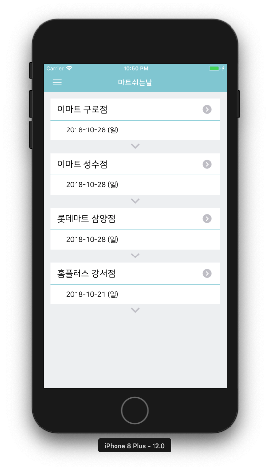
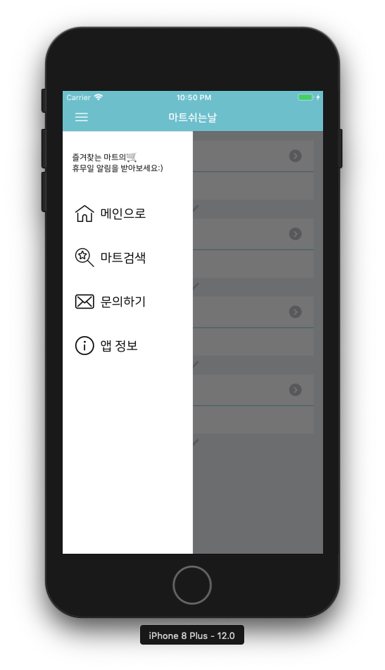
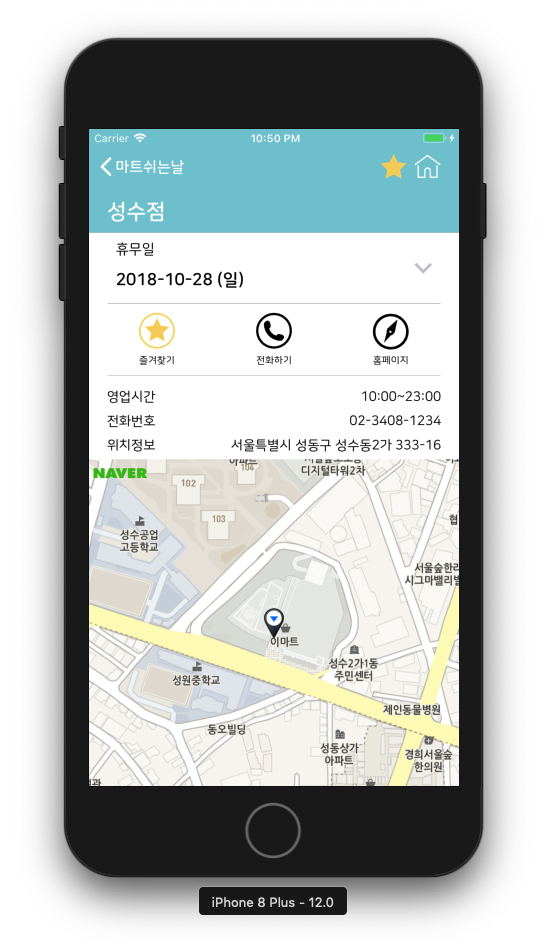
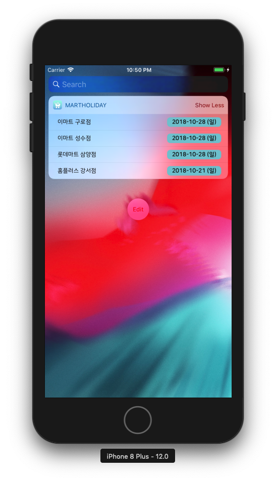
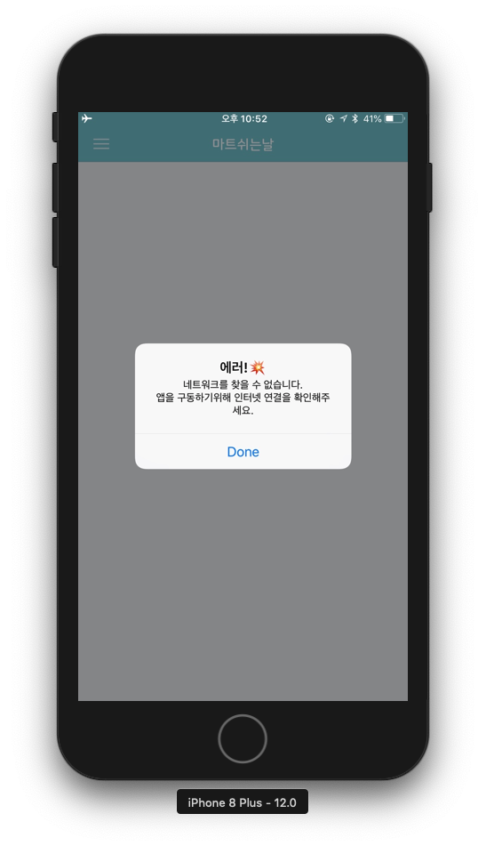

# 마트쉬는날
> 마트 휴무일을 매번 검색하기 귀찮은 사람들을 위한 알리미 애플리케이션

## 앱스토어 링크
- [App Store](https://itunes.apple.com/kr/app/%EB%A7%88%ED%8A%B8%EC%89%AC%EB%8A%94%EB%82%A0-%ED%9C%B4%EB%AC%B4%EC%9D%BC-%EC%95%8C%EB%A6%AC%EB%AF%B8/id1438702208?mt=8)

## 주요 기능
- 브랜드별 마트 검색, 상세정보를 제공한다.
- 즐겨찾는 마트를 저장할 수 있고, 즐겨찾는 마트의 휴무일을 앱 메인 화면과 위젯에서 확인할 수 있다.
- 즐겨찾는 마트의 휴무일 하루 전, 유저에게 푸시로 휴무일 알림을 보낸다.

## 구현 기술
- Network, Push Notification, Today Extension, UISearchController, Error handling, UserDefault, Codable, NSKeyedArchiver, Custom View(SlideMenu), Custom Delegate, Autolayout, xib 등

### 아키텍쳐
- MVC

### 경험한 디자인 패턴
- Delegate, Singleton, Protocol Oriented

### 사용한 툴
- TestFlight, Xcode9, Xcode10(프로젝트 진행 중 업데이트), GitHub(버전 및 이슈관리)

### 사용한 라이브러리
- Firebase(FCM, Database, Storage) : 푸시기능을 구현하기위해 사용자 정보를 저장하고 클라우드 메시지를 전송하는데에 사용
- 네이버지도(NMap) : 마트 위치 표시를 위해 사용. 구글지도나 애플지도보다 국내 점포의 위치 파악이 훨씬 잘되어있어 네이버지도 사용함
- [Reachability.swift](https://github.com/ashleymills/Reachability.swift) : 네트워크 상태 변화 감지를 위해 사용
- [NVActivityIndicatorView](https://github.com/ninjaprox/NVActivityIndicatorView) : 화면 로딩중임을 알리기위한 인디케이터를 표시하기 위해 사용

## Troubleshooting

### App Crash
- AppStore 첫번째 심사 결과: Reject
  - 사유: `We were unable to review your app as it crashed on launch.`
- Crash report 분석결과, **AppDelegate내의 FCM푸시토큰을 받아오는 콜백함수에서 옵셔널 값에 접근하는 문제가 있었다.**
- Optional Forced-unwrapping으로`Bool!`타입으로 선언된 변수가 있었고, 해당 변수에 값이 할당되기 전에 콜백함수 내에서 해당 변수에 접근한 문제
- 앱을 처음 설치하면 Push Notification 승인에 대한 alert가 화면에 나타나는데, 문제가 되는 변수에 값을 할당하기위해서는 해당 alert의 버튼을 선택해야했음.
- 하지만 해당 alert의 `allow` / `don't allow`를 바로 선택하지 않고 기다리면 콜백함수가 먼저 실행되어, `nil`값에 접근하는 상황이 발생함.
- **해결: 해당 변수를 `Bool?`타입으로 선언하고 바인딩 후 사용하는 방식으로 변경**

#### 짧은 회고
- 실행 시점을 정확히 예측하기 힘든 콜백함수에서는 어떤 작업을 하든지 신중하게 해야한다는 점
- 따라서 여러 상황을 가정해서 테스트해야한다는 점(사용자가 당연히 내가 예상하는 액션을 그대로 할 것이라고 예상하지 말것)
- 옵셔널처리같은 사소한 문제에서 정만 critical한 문제가 발생한다는 점을 깨달음

## 주요 구현사항

### 1. 즐겨찾기 데이터 모델 설계
- 한 유저당 하나의 즐겨찾기(`FavoriteList`객체)만 존재해야하므로, Singleton으로 구현
- 즐겨찾기를 pop / push 한 후 성공여부를 전달하기위해 Bool값을 리턴하는 것으로 구현
- 이와 관련하여, 즐겨찾기를 pop / push 이벤트를 받는 버튼을 StarButton객체로 추상화하고 해당 버튼을 사용하는 뷰컨트롤러를 `FavoriteTogglable` 프로토콜로 추상화
- 유저가 앱을 실행할때마다 가장 마지막(최근)시점에 설정했던 즐겨찾기 데이터가 표시되어야하기에, 설정값 저장하는 기능이 필요함
- NSCoding을 구현하고 UserDefaults와 NSKeyedArchiver를 사용해서 객체를 아카이빙하는 방식으로 저장

### 2. Push Notification
- Firebase Cloud Message(FCM)를 이용하여 구현
- 초반엔 마트 지점별로 주제구독방식을 선택하였는데, Firebase API에서도 해당 방식 자체가 푸시 전송이 누락될 가능성이 높다고 권고함
- 또한 유저의 사용성마다의 여러 가능성에따라 푸시 구독 / 구독취소된 항목이 푸시서버와 싱크가 맞지 않는 다수의 케이스 발견
- 단일기기전송방법으로 변경하고 Firebase DB에 사용자토큰으로 즐겨찾기 정보 저장
- 토큰에 대한 즐겨찾기 정보를 조회하고 FCM API를 이용하여 단일기기에 푸시 전송하는 방식으로 구현

### 3. 슬라이드 메뉴 커스터마이징
- SlideMenuView 델리게이트 커스터마이징
- 앱 내의 메뉴들을 표시하는 SlideMenuView를 컬렉션뷰를 사용해서 만듦
- 하지만 슬라이드메뉴를 가진 `MainViewController`의 코드양이 슬라이드메뉴의 Delegate와 Datasource역할까지 하기때문에 코드가 너무 길어진 문제
- 델리게이트 객체를 따로 만들고, 뷰컨트롤러와 분리하여 SlideMenuView의 델리게이트 지정해줌
- SlideMenuView를 구성하는 컬렉션뷰 셀과 일반 뷰(문구 표시용 헤더)는 xib로 구현

### 4. Custom Delegate 활용
> Protocol - Oriented 시도

- 애플리케이션을 구성하는 View마다 사용하는 기능이 여기저기서 재사용되는 일이 많았음
- View에 대한 Delegate객체 구현시 Protocol을 활용하여 수평적 기능확장, 재사용성을 높임
- MainViewController나 DetailViewController에서 사용하는 Expandable TableView구현시 뷰와 모델간 이벤트 처리를 위한 Custom Delegate 사용하여 재사용성 높임
- NMapView Delegate객체를 담당하는  재사용성을 높여 ViewController의 중복 코드 제거

## 개선점
- 마트 지점 데이터 갱신 주기
  - 사용자 유입이 많아지고 서버 비용이 올라가면 검색 화면을 띄울때마다 서버에 요청을 보낸다면 무리일 것으로 판단
  - 처음에 우려했던, 유저가 주기적으로 앱을 실행하지 않으면 최신 데이터가 업데이트되는 주기와 싱크가 맞지 않을 수 있다는 문제점은 위젯에서 항상 최신 데이터를 표시해주는 것으로 해결되었음(위젯은 표시할때마다 사용자의 즐겨찾기에 맞는 최신 정보만 가져옴)
  - 전체 마트 정보가 갱신되는 주기는 평균적으로 2주 ~ 한 달 사이로 짧지 않기때문에, 새로운 데이터를 받았을때 데이터 저장 후 사용
  - 사용자의 마지막 앱 실행시점이 얼마나 지났는지 판단해서 새로운 데이터를 요청할지 캐싱된 데이터를 사용할지 판단
- 앱에 필요한 리소스를 Firebase Storage에서 로딩하는 것으로 변경
  - 현재 '앱정보'메뉴에 표시되는 라이선스정보는 Firebase Storage에 `.txt`파일로 저장 후 네트워크로 받아서 표시하는 방식을 사용중
  - 따라서 이런식으로 변경이 자주 될 리소스는 따로 앱 업데이트를 하지 않아도 최신 정보로 표시되도록 구현함
  - 마트 브랜드를 표시하는 마트 로고 이미지또한 Storage에 저장하여 받아오는 방식으로 구현하여 앱 업데이트가 필요없도록 구현
- `Mart`객체 커스텀 방식 변경
  - 마트를 담당하는 `Mart`객체들을 지금처럼 enum으로 구현하는것이아닌, 서버에서 받아오는 방식으로 구현하고 마트가 추가되어도 앱 업데이트가 필요없도록 구현

## 스크린샷

